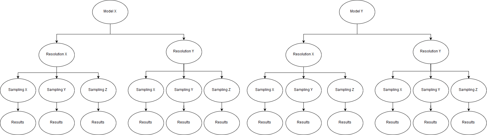

**Exploration of accuracy impacts on tree species classification**

This repository hosts our code to generate insights into the impacts determining the accuracy of tree species classification which uses UAV-based collected RGB time-series of temperate mixed forest in Caldern, Germany. 

We implement an experimental procedure testing the impact of following parameters:

(1.) Accuracy gain/loss by using phenological predictors based on the whole time-series vs. mono-temporal predictors only

(2.) Accuracy gain/loss of different sampling strategies of which pixels of a tree object will be part of the training process

(3.) Accuracy gain/loss of different levels of spatial aggregation/resolution

(4.) Suitability of different  machine learning algorithms to model tree species based on the different data levels of (1.-3.)

Structure to organize our code:

- Sampling strategy: a script including functions to accomplish different sample selection of raster pixels within polygons representing trees
- Spatial resolution: a script including functions to aggregate the raster data on different spatial scales
- Predictors: a script including functions to obtain mono-temporal predictors as well as seasonal parameters
- Training Preparation: a script preparing the different levels of training data for each run
- Model Building: a script taking different levels of training data and piping it through a selection of machine learning algorithms, the models and validation results should be saved immediately and comprehensively
- Data exploration: a script exploring the results of the experiment, possibly already creating plots, comparison values etc..
- 